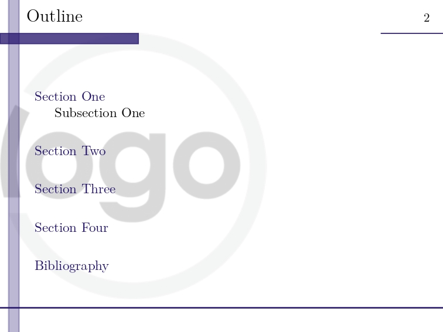
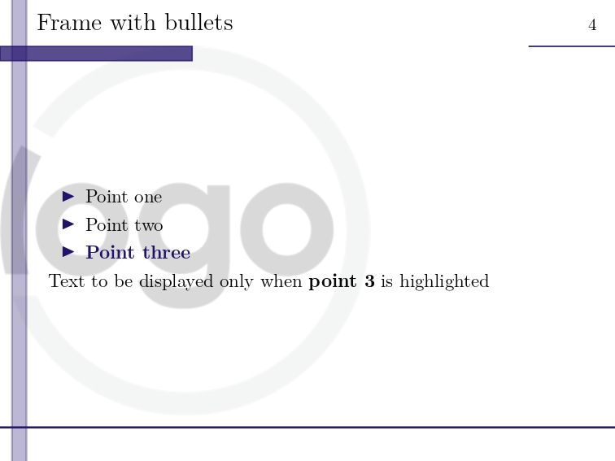
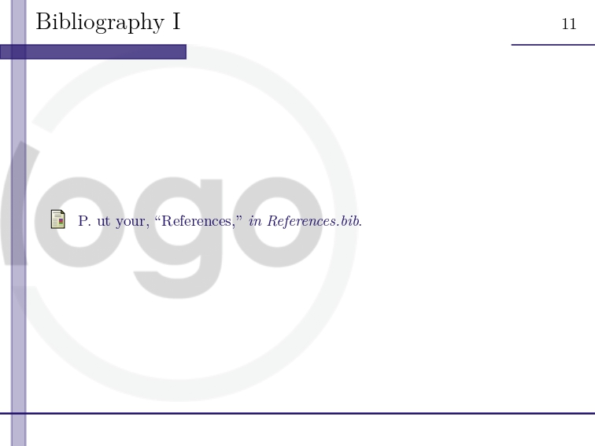

# Minimal Presentation Template in Beamer

>[!Important]
>This is something I put together from various sources for my Thesis presentation. In no way it is optimized or guaranteed to perfectly work. You can use it, modify it, or play with it to suit your taste.

This repository contains a minimal template for creating presentations using the Beamer package in LaTeX.  You can add any logo of your own in the `logos` folder and renaming it to `logo.png`.

You can also define more colors and modify the coloring in the themes by making changes to the `beamercolorthememinimal.sty` file, like 

Take a look at the `presentation.tex` and `presentation.pdf` for a sample.

## Title Frame

## Table of Contents

## Section Frame

## Content Frame

## References 

